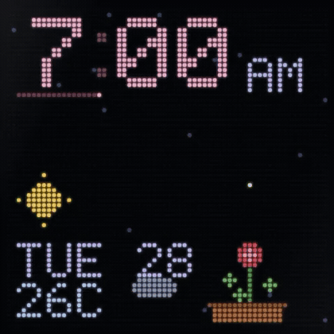
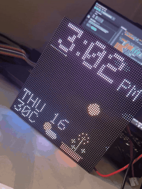
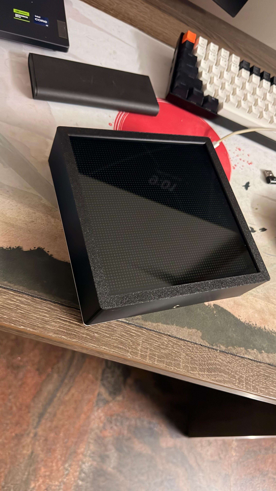
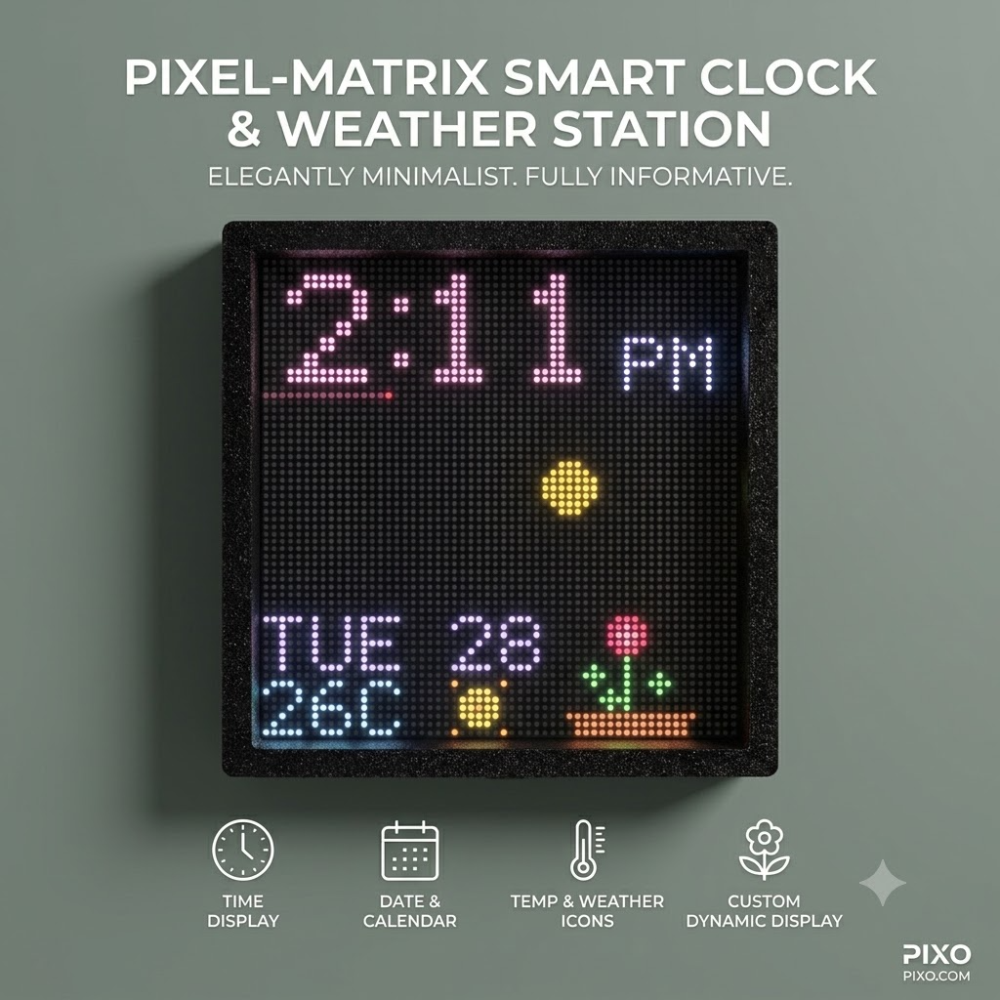

# DigiFrame ⏰

A **64×64 HUB75 LED matrix smart clock** running on an ESP32-S3. It shows an
NTP clock, live weather, a living ambient scene, looping GIFs, scrolling
messages, and runs themed celebrations on your special days. Configure and
control it from a **cloud dashboard over Bluetooth**, the **clock's own web
dashboard** on your WiFi, a **Telegram bot**, or **Home Assistant** (MQTT).

> Source-available for **DIY / noncommercial** use — contributions welcome. Commercial use needs a [separate license](#license).

[](LICENSE.md)
[](https://github.com/sponsors/manoharc07)

<p align="center">
  
  <br><em>The clock face — time, weather and the living ambient scene.</em>
</p>

<p align="center">
  
  <br><em>Running live in the glass frame.</em>
</p>

<p align="center">
  
  
</p>

## Features

- **Clock + weather** — NTP time and Open-Meteo weather (no API key), with an
  animated ambient scene and automatic night dimming.
- **GIFs** — a default pack is embedded and seeded to flash on first boot;
  upload your own. Any `c_*.gif` joins a "character pack" that makes random
  cameos.
- **Messages** — scroll a note for a while, or pin one until you stop it.
- **Special days** — give a date a **type** (`custom` → fireworks, `birthday` →
  cake + confetti) and a message; at midnight the clock runs that themed
  celebration all day. Add them from any dashboard or Telegram.
- **Telegram bot** — control playback, messages, brightness, special days and
  more from anywhere, with tap-able button menus.
- **Home Assistant** — optional MQTT integration with auto-discovery: brightness,
  a message box, celebrate/stop buttons, and temperature/mode sensors.
- **Three ways to configure**: cloud site over Bluetooth, the on-device web
  dashboard, or Telegram.
- **OTA firmware updates** from the on-device dashboard.

## Hardware

- ESP32-S3 dev board (tested on N16R8: 16 MB flash, 8 MB OPI PSRAM)
- 64×64 HUB75 RGB LED matrix, 2.5 mm pitch — e.g. the **Waveshare P2.5 64×64** panel
- **5 V power supply** for the panel (≈2–4 A; sized for brightness), plus the
  16-pin HUB75 ribbon + a few jumper wires
- Optional: the 3D-printed enclosure below + a 3.5 mm thin glass front

## Wiring

The panel is driven over the 16-pin **HUB75E** header on the panel's **input**
side (the arrow points *away* from IN; some panels label it `J1`/`IN`). The
GPIO assignments live in [`config.h`](firmware/DigiFrame/config.h) — change them freely, just
avoid the reserved pins noted there. Defaults for the ESP32-S3:

| HUB75 signal | Meaning            | ESP32-S3 GPIO |
|--------------|--------------------|:-------------:|
| R1           | red (top half)     | 4  |
| G1           | green (top half)   | 5  |
| B1           | blue (top half)    | 6  |
| R2           | red (bottom half)  | 7  |
| G2           | green (bottom half)| 15 |
| B2           | blue (bottom half) | 16 |
| A            | row address A      | 18 |
| B            | row address B      | 8  |
| C            | row address C      | 9  |
| D            | row address D      | 10 |
| E            | row address E      | 42 |
| CLK          | pixel clock        | 41 |
| LAT / STB    | latch              | 40 |
| OE           | output enable      | 2  |
| GND          | ground             | GND (shared) |

HUB75E header layout (pin 1 is usually marked on the connector):

```
      ┌──────────┐
 R1 → │ 1     2  │ ← G1
 B1 → │ 3     4  │ ← GND
 R2 → │ 5     6  │ ← G2
 B2 → │ 7     8  │ ← E      (E on 1/32-scan 64×64 panels; GND on 1/16 panels)
  A → │ 9    10  │ ← B
  C → │11    12  │ ← D
 CLK→ │13    14  │ ← LAT
 OE → │15    16  │ ← GND
      └──────────┘
```

**Power & grounding (important):**
- Power the **panel from the 5 V supply**, into its power lugs/terminals — do
  **not** run the panel off the ESP32's 5 V pin (it can't supply the current).
- The ESP32-S3 is powered over USB (or its own 5 V).
- Tie the **PSU ground, panel ground, and ESP32 ground together** (common GND) —
  the HUB75 `GND` pins above cover the signal ground.
- `E` is **required** for 64×64 (1/32-scan) panels. Keep signal jumpers short
  (< ~15 cm) or use a HUB75 adapter board to avoid flicker/ghosting.

On first power-up the panel shows `HELLO`, then the WiFi **setup QR** — follow
*Setup & control* below.

## Enclosure (3D-printable)

A two-part frame is in [`stl/glass-frame/`](stl/glass-frame):

- `frame-box-v1.stl` — the body that holds the panel and electronics
- `frame-lid-v1.stl` — the back lid

It's designed around the **Waveshare P2.5 64×64** panel with a **3.5 mm thin
glass** sheet at the front (the glass diffuses the LEDs and gives a clean
finish). Print in PLA/PETG; the glass drops into the front recess, the panel
sits behind it, and the ESP32 + wiring tuck inside before the lid closes.

## Build & flash

Full instructions in [`FLASHING.md`](FLASHING.md). In short:

```
arduino-cli compile --fqbn esp32:esp32:esp32s3:FlashSize=16M,PSRAM=opi,PartitionScheme=custom --output-dir build firmware/DigiFrame
```

Board: **ESP32S3 Dev Module**, Flash 16 MB, PSRAM **OPI PSRAM**, Partition
scheme **Custom** (uses the sketch's `partitions.csv` — 4 MB OTA app slots +
~7.9 MB data). Libraries (Library Manager): `ESP32 HUB75 LED MATRIX PANEL DMA
Display`, `Adafruit GFX Library`, `AnimatedGIF`, `UniversalTelegramBot`,
`ArduinoJson`, `NimBLE-Arduino`, `PubSubClient`.

## Setup & control

On first boot, if the frame can't reach a stored WiFi it opens a hotspot and
shows a QR code.

### 1. Cloud dashboard over Bluetooth (Android / Chrome / Edge)

The panel QR opens a **cloud-hosted static site** (in [`website/`](website/))
that pairs with the frame over **Web Bluetooth** — no backend, no account. Use
it to set WiFi, brightness, messages, GIFs, weather location, Telegram config,
and watch live logs. Host it yourself (Netlify/Vercel/Cloudflare Pages — see
[`website/README.md`](website/README.md)) and point `CLOUD_SITE_URL` in
`config.h` at your URL.

> iPhone/iPad Safari doesn't support Web Bluetooth — those users use path 2.

### 2. On-device dashboard on your WiFi (any browser, incl. iPhone)

Join the `DigiFrame` hotspot (or, once online, open `http://digiframe.local`)
and use the frame's built-in dashboard — the same controls, served locally.
This is also the recovery path if Bluetooth is unavailable.

### 3. Telegram bot (anywhere)

Create a bot with @BotFather, set the token + your chat id (via any dashboard),
and control the clock remotely. Send `/menu` for the button menu.

### 4. Home Assistant (MQTT)

Enable MQTT and set your broker (e.g. the Mosquitto add-on) from any dashboard.
The clock announces itself to Home Assistant via MQTT discovery as a device with
brightness, a message text box, celebrate/stop buttons, and temperature/mode
sensors. Off by default.

## How it works

Single Arduino sketch, dual-core FreeRTOS. **Core 1** owns the LED panel,
GIF decoder, web server and mode state; **core 0** runs Telegram polling,
weather fetches, the NimBLE host, and the MQTT client. A shared
[`control.h`](firmware/DigiFrame/control.h) layer holds one implementation per action, so every
front-end (HTTP dashboard, Bluetooth, Telegram, Home Assistant) behaves
identically; core-0 tasks marshal work to core 1 through a command queue (they
never touch LittleFS or the panel directly).

The BLE contract is documented in [`BLE_PROTOCOL.md`](BLE_PROTOCOL.md).
Architecture details and invariants are in [`CLAUDE.md`](CLAUDE.md).

## Configuration & security

`config.h` holds only compile-time **defaults** (placeholders like
`YOUR_WIFI_SSID` / `YOUR_BOT_TOKEN`); real values are entered at runtime and
persisted to `/config.json` on the device. Treat any token/password you flash
in as sensitive and don't commit real ones.

Both config surfaces are **unauthenticated**: the web dashboard is LAN-only,
and the BLE service uses "just works" pairing (short range, same room). If you
deploy DigiFrame somewhere less private, enable passkey pairing in
`ble_config.h`. See the security note in `BLE_PROTOCOL.md`.

## Roadmap

- **Smart widgets** — now-playing, stock/finance tickers, and other
  at-a-glance widgets on the clock face.
- **Cloud relay backend** — optional server so the website can reach the clock
  from anywhere (and cover iPhone), instead of Bluetooth-only. Today Telegram
  and Home Assistant fill that role.
- Passkey BLE pairing shown on the panel, on by default.

## Support the project

DigiFrame is free for DIY / noncommercial use. If it helped you or you just want
to say thanks, you can sponsor me on GitHub ❤️ — it funds more features:

[](https://github.com/sponsors/manoharc07)

## License

**Source-available, noncommercial** — free for personal, hobby/DIY, educational,
and research use under the [PolyForm Noncommercial License 1.0.0](LICENSE.md).

**Commercial use** (selling the device or firmware, or bundling it into a paid
product or service) **requires a separate license** — contact
[@manoharc07](https://github.com/manoharc07) to arrange terms.
